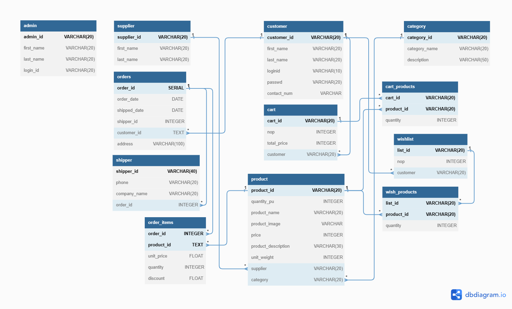

# B2C E-commerce Project


<a href="https://drive.google.com/file/d/1aKI5Gx9vJTlt0LpGvs81RN3DmCEC4FEH/view?usp=sharing">

</a>


## Description

Our project involves the development of a B2C e-commerce website using Python Flask, Postgres SQL, and SQLAlchemy ORM. The website offers a user-friendly interface for customers to browse and purchase products online. It provides various features to enhance the shopping experience, including product search, cart management, and secure checkout using the Stripe API. The general purpose of this project is to make a web application with proper functioning frontend and backend (a database providing all the necessary tables and data) for a General Purpose E-commerce website based on the concept of B2C (Business to Consumer).

## Technologies

- Python
- Flask
- Postgres SQL
- SQLAlchemy ORM
- HTML/CSS
- JavaScript
- GSAP
- Plotly Dash

## File Structure

1. main.py:
   This Python file is the primary script that starts the localhost and thus the application itself.
2. views.py:
   This Python file contains the code for routing the app to different references and also the rendering of HTML files of the store. This also contains the interactions with the database.
3. admin.py (beta): This file contains the admin portal. Our admin panel allows administrators to efficiently manage the product inventory. They should be able to add new products, update existing product information, and remove products that are no longer available. The admin panel also provides analytics data such as product performance and revenue to help them monitor the success of different products and make data-driven decisions.
4. models.py:
   This file contains the classes of all the relational models of our database.
5. static:
   This folder contains all the static files such as images, JavaScript, and CSS.
6. templates:
   This directory contains all the HTML files that need to be rendered.

## Installation

1. Clone the repository:

```shell
git clone https://github.com/AhabbscienceStudioPak/B2C-E-commerce-Project.git
```

2. Change to the project directory:

```shell
cd B2C-E-commerce-Project
```

3. Install the required dependencies:

```shell
pip install -r requirements.txt
```

4. Set up the environment variables for Stripe checkout:

Create a .env file in the project root directory.
Add the following environment variables and their respective values to the .env file:

```env
STRIPE_PUBLISHABLE_KEY = your-stripe-publishable-key
STRIPE_SECRET_KEY = your-stripe-secret-key
```

5. Run the application:

```shell
python main.py
```

## Schema



## Team Members

- 2021327 M. Ahabb Sheraz
- 2021510 Nauman Asif
- 2021609 Sohaib Nasir

## Contributing

We welcome contributions from the community to enhance our e-commerce website. If you find any issues or have suggestions for improvement, please submit a pull request or open an issue in the repository.
